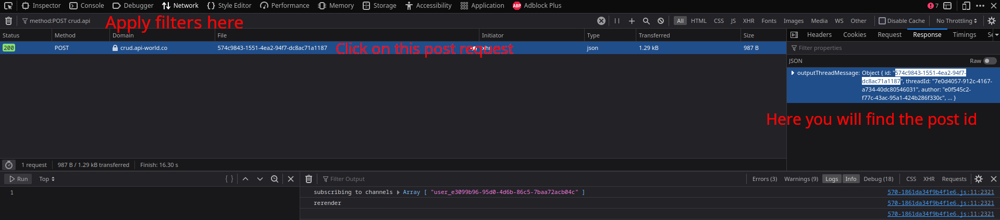

## Basic usage

```
python super_likes.py --id <your_post_id>
```
### How to get post id.
#### 1) Open  in your favourite web browser.
(I will be using firefox in this example)
#### 2) Open `More Tools` --> `Web Developer Tools` (or `Ctrl+Shift+I`) and select `Network` tab.
(wolrds.co is an extremly laggy website, please be patient)
#### 3) Filter your requests by POST and add extra filtering for api like this `method:POST crud.api`.
#### 4) Click like button on a desired post.
#### 5) Single post request should appear, click on it and select `Response` tab. You will find your post id there.
### Here is how it looks like in firefox:



## All available options

|     Option     |                         Description                          | Values |
|:--------------:|:------------------------------------------------------------:|:------:|
|     --id    |                      Post id. See how to get it below                      | string  |
|    --max_likes    |            Max amount of likes. After reaching it, bot will stop liking your post            |  int   |
| --cooldown |                Cooldown in seconds. Optimal amount is 60, not recommended to change.                |  int   |
